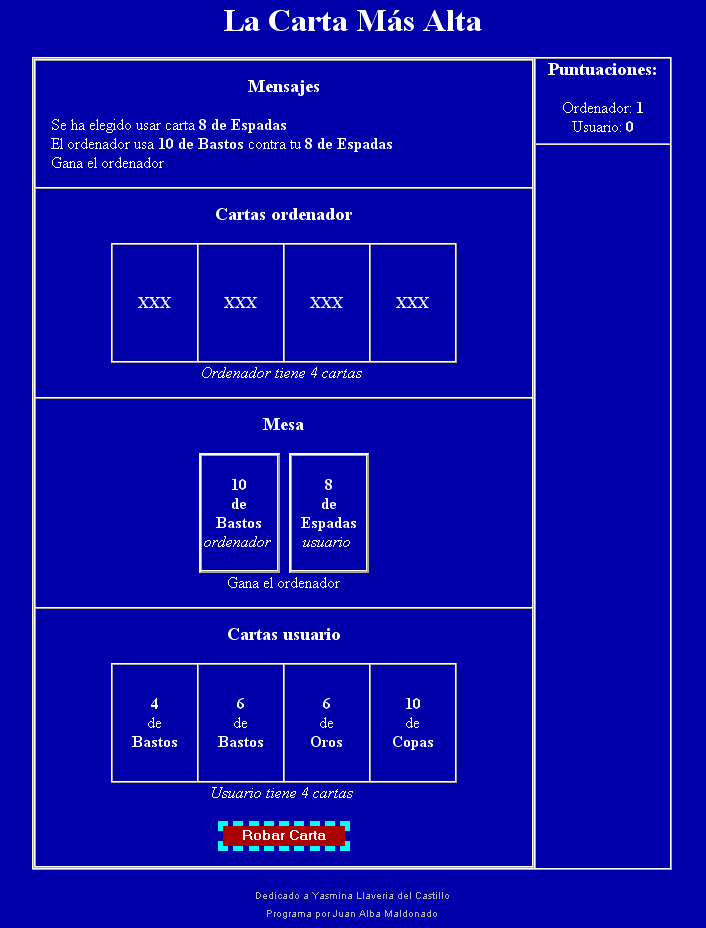

La Carta Mas Alta 
================== 
by Joan Alba Maldonado (joanalbamaldonadoNO_SPAM_PLEASE AT gmail DOT com, without NO_SPAM_PLEASE)

Card game totally written in PHP and HTML.

Created on 19th December 2005 (approximately).

You can donate at http://sourceforge.net/donate/index.php?group_id=173637

## Description

Open source card game made with PHP, HTML and a little bit of CSS.

It is in Spanish language and will work in any web browser, even without CSS support.

The game is minimalist and it doesn't use any image at all but only text created with pure HTML and tables. So you will be able to play it in a text-based browser too, such as Links and Lynx.

This cross-platform and cross-browser game has been tested under BeOS, Linux, NetBSD, OpenBSD, FreeBSD, Windows, Mac OS X, QNX, BlackBerry Tablet OS, Android, iOS and others.

Play online: http://lcma.tuxfamily.org/lcma_spanish/

Play online (mirror): http://www.dhtmlgames.com/lcma/lcma_spanish/

Official web site: http://lcma.tuxfamily.org/ (mirror at http://www.dhtmlgames.com/lcma/).